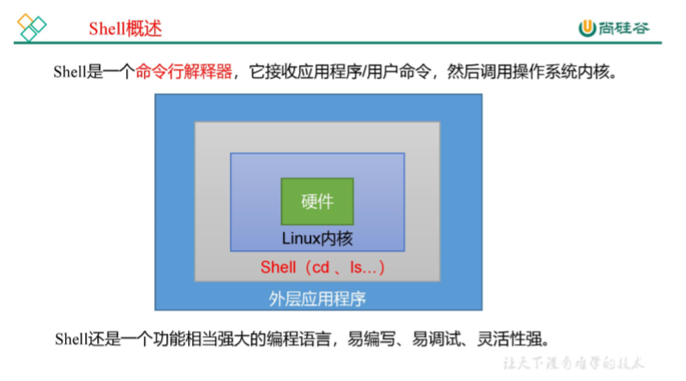

# Shell编程

## 一、介绍

shell是一个程序，采用C语言编写，是用户和Linux内核沟通的桥梁，它既是一种命令语言，又是一种解释性的编程语言。如下图所示



**shell脚本具有如下功能**

- 命令行解释功能
- 启动程序
- 输入输出重定向
- 管道连接
- 文件名替换(echo /*)
- 变量维护
- 环境控制

## 二、shell中的特殊符号

| 符号            | 含义                                                         |
| --------------- | ------------------------------------------------------------ |
| #               | 注释作用, #! 除外                                            |
| ;               | 命令行分隔符, 可以在一行中写多个命令. 例如p1;p2表示先执行p1,再执行p2 |
| ;;              | 连续分号 ,终止 case 选项                                     |
| ""              | 双引号，软转义，解释变量的内容                               |
| ''              | 单引号，硬转义，内容原样输出，不解释变量                     |
| \|              | 管道, 分析前边命令的输出, 并将输出作为后边命令的输入.        |
| >\|             | 强制重定向                                                   |
| \|\|            | 逻辑或                                                       |
| ()              | 指令数组 ,用括号将一串连续指令括起来,如 ``` (cd ~ ; vcgh=`pwd` ;echo $vcgh)``` |
| $()             | ``` 与 `` 一样，命令替换```                                  |
| ${}             | 一般情况下，$var与${var}是没有区别的，但是用${ }会比较精确的界定变量名称的范围。如`A=Linux;echo $AB(无输出) # 表示变量AB.  echo ${A}B  输出：LinuxB # 表示变量A后连接着B` |
| $[]             | 计算逻辑表达示 `a=1; echo $[a+1]; 输出2`                     |
| (())            | for循环中C语言格式语法                                       |
| $(())           | 计算数学表达式                                               |
| $0              | 当前执行的进程/程序名                                        |
| $#              | 脚本后面接的参数的个数                                       |
| $*              | 参数列表，双引号引用为一个字符串                             |
| $@              | 脚本后面所有参数，参数是独立的，也是全部输出                 |
| $$              | 当前所在进程的进程号                                         |
| $?              | 上一个命令的退出状态 0成功， other 失败                      |
| $!              | 后台运行的最后一个进程的进程ID号                             |
| !$              | 调用最后一条命令历史中的参数                                 |
| !               | 执行历史记录中的命令 : ! 命令id                              |
| !!              | 执行上一条命令                                               |
| []              | 计算逻辑表达式，与 test 一样, 如 ` test -d /root/` 等同于 ` [-d /root/]` |
| [[]]            | 字符串匹配                                                   |
| &               | 后台运行命令                                                 |
| &&              | 逻辑与                                                       |
| >               | 重定向输入 覆盖原数据                                        |
| >>              | 重定向追加输入，在原数据的末尾添加                           |
| <               | 重定向输出  例如： wc -l < /etc/paawd                        |
| <<              | 重定向追加输出  例如: fdisk /dev/sdb <<EOF ... EOF # 追加输入的内容为 fdisk 需要的参数 |
| 1               | 标准输出                                                     |
| 2               | 标准错误输出                                                 |
| >/dev/null 2>&1 | 标准输出和标准错误都重定向到了/dev/null                      |
| 2>&1 >/dev/null | 意思是把标准错误输出重定向到标准输出后重定向到/dev/null      |
| 1>&2 >/dev/null | 意思是把标准输出重定向到标准错误后重定向到/dev/null          |
| &> /dev/null    | 不管你是啥玩意儿文件描述符，通通重定向到/dev/null            |

## 三、格式化输入输出

**格式化输出： echo** 

- -n 不要自动换行

```shell
[root@node01 ~]# echo  "date: ";date +%F
date: 
2021-11-02


[root@node01 ~]# echo -n "date: ";date +%F # 不自动换行
date:2021-11-02
```

- -e 解释转义字符

```shell
[root@hadoop101 ~]# echo "\n hello world"
\n hello world
[root@hadoop101 ~]# echo -e "\n hello world"  # 解释转义字符

 hello world
```

常见的转义字符： 

- \a 发出告警声


- \b 删除前一个字符


- \t 插入 tab


- \n 换行且光标移动到行首


```shell
# 倒计时脚本
# time.sh

#!/bin/bash
for time in `seq 9 -1 0`;do
	echo -n -e "\b$time"
	sleep 1
done

echo
```

**颜色代码**

```shell
格式如下：
echo -e "\033[背景色;字体颜色 m字符串 \033[0m"

例如:
echo -e "\033[41;36m Hello World\033[0m"

其中
41 代表文字背景色
36 代码字体颜色
字符串前后可以没有空格，如果有的话，输出也同样有空格

字体颜色： 30-37
字体背景色： 40-47

最后面的控制选项说明
\033[0m 关闭所有属性
\033[1m 设置高亮度
\033[4m 下划线
\033[5m 闪烁
\033[7m 反显
\033[8m 消隐
```

**格式化输入：  read**

-p 打印信息

-t 限定时间

-s 不显示输入的内容

-n 限制输入字符的个数

```shell
# 模拟登陆界面

#!/bin/bash

IP=`ifconfig ens33|egrep -w "inet"|awk '{print $2}'`

#1、清屏
clear
#2、输出提示信息
echo "CentOS Linux 8 (Core)"
echo -e "Kernel `uname -r` on an `uname -m`\n"

echo -e "Web console: https://localhost:9090/ or https://$IP:9090/ \n"

#3、交互输入登陆名
echo -n "$HOSTNAME login: "
read account

#4、交互输入密码
read -s -t30 -p "Password: " pw
echo
```

## 四、变量

变量是在编程中最常用的一种临时在内存中存取数据的方式

### (一)、命名规则

- 只能用英文字母，数字和下划线，不能以数字开头
- 变量名和"="中间不能有空格
- 不能使用bash里的关键字

### (二)、变量的设置与取消

```shell
name="zhangsan" # 设置变量
echo $name
unset name # 取消变量
```

### (三)、有类型变量 declare

- -i  将变量看成整数
- -r  使变量只读， 该变量的值无法更改，且不能 unset
- -x  标记变量通过环境导出 export
- -a  指定为索引数组
- -A  指定为关联数组

### (四)、变量分类

1. 本地变量：用户自定义的变量，定义在脚本或者当前终端中，脚本执行完毕后或终端结束后变量失效

2. 环境变量：定义在用户家目录下的 .bashrc 或者 bash_profile 文件中，用户私有变量，只能本用户使用

   - env   :   查看当前用户的环境变量
   - set    :   查询当前用户的所有变量（临时变量与环境变量）

3. export 将当前变量变成环境变量

   运行 shell 脚本时， 系统将创建一个子shell，此时，系统中将有两个 shell ， 一个是登录时系统启动的shell（父shell）, 另一个是系统为运行脚本程序创建的 shell （子shell）， 两个 shell 在运行的过程中本地变量是不能够共用的，只有环境变量能共用。

   当在父shell中创建了一个本地变量和一个环境变量时，脚本能调用环境变量，但是不能调用本地变量。因为本地变量不能赋值给子 shell ，而父 shell 可以把环境变量赋值给子 shell.

   ```shell
   [hadoop@hadoop101 ~]$ _age=18
   [hadoop@hadoop101 ~]$ export _name='zhangsan'
   [hadoop@hadoop101 ~]$ vi test.sh 
   echo $_age
   echo $_name
   [hadoop@hadoop101 ~]$ vi test.sh 
   [hadoop@hadoop101 ~]$ bash test.sh 
   
   zhangsan
   
   #从脚本执行的结果来看，只有环境变量打印出来了
   ```

4. 全局变量：所有用户都可以使用，保存在 /etc/profile、/etc/bashrc文件中

   - printenv  :   打印全局变量

5. 内置变量

   内置shell中的变量，也称为系统变量， shell 本身已定义好了它的名字和作用

   如  $?、 $# 、 $@ 等

   ```shell
   cat 2.sh 
   #!/bin/bash
   echo "\$0 = $0"
   echo "\$# = $#"
   echo "\$* = $*"
   echo "\$@ = $@"
   echo "\$1 = $1"
   echo "\$2 = $2"
   echo "\$3 = $3"
   echo "\$11 = ${11}"
   echo "\$12 = ${12}"
   
   bash 2.sh a b c d e f g h i j k l m n
   $0 = 2.sh
   $# = 14
   $* = a b c d e f g h i j k l m n
   $@ = a b c d e f g h i j k l m n
   $1 = a
   $2 = b
   $3 = c
   $11 = k
   $12 = l
   ```

   $* 与 $# 的区别

   $*  :  表示将变量看成一个整体 

   $#  :   表示变量是独立的

## 五、Shell中的运算

### (一)、数学运算

**四则运算符：** + - * \ 【加减乘除】

**扩展：** % ** 【取余 开方】

**运算命令:**

- 整形运算
  
  – expr
  
  – let
  
  – $(())
  
  – bc
  
- 浮点运算
  
  – bc

```shell
 # expr 命令: 只能做整数运算， 注意空格
[root@node01 ~]# expr 1 + 1
2
[root@node01 ~]# expr 5 \* 2  # 乘法运算需要转义
10

# let命令:只能做整数运算，且运算元素必须是变量，无法直接对整数做运算
[root@node01 ~]# let a=100+3;echo $a
103
[root@node01 ~]# let a++;echo $a
104
[root@node01 ~]# let a--;echo $a
103

# 双小圆括号运算，在shell中(( ))也可以用来做数学运算
[root@node01 ~]# echo $((100+3)) 
103

# 浮点数比较
# bc 是linux 文件界面的计算器， 检查机器有没有安装 bc
[root@node01 ~]# rpm -qf `which bc` # 检查机器有没有安装bc
[root@node01 ~]# yum -y install bc # 如果没有安装就手动安装下

[hadoop@hadoop101 ~]$ bc
bc 1.06.95
Copyright 1991-1994, 1997, 1998, 2000, 2004, 2006 Free Software Foundation, Inc.
This is free software with ABSOLUTELY NO WARRANTY.
For details type `warranty'. 
1+2+3
6


1.2+1.3
2.5

scale=2  # 除法运算时可以指定保留的小数范围
100/3
33.33

quit

[root@node01 ~]# echo "scale=3;100/3"|bc
33.333
[root@node01 ~]# echo "0.3 > 0.2"|bc  # 大于返回1
1
[root@node01 ~]# echo "0.1 > 0.2"|bc # 小于返回 0
0
```

### (二)、比较运算

#### 整形比较

```
运算符解释：

 精确比较
        -eq         等于 equal

        -gt         大于

        -lt         小于

 模糊比较
        -ge         大于或等于

        -le         小于或等于

        -ne         不等于
```

```shell
[root@zutuanxue ~]# test 100 -gt 300;echo $?
1
[root@zutuanxue ~]# test 100 -ge 300;echo $?
1
[root@zutuanxue ~]# test 100 -eq 300;echo $?
1
[root@zutuanxue ~]# test 100 -le 300;echo $?
0
[root@zutuanxue ~]# test 100 -lt 300;echo $?
0
[root@zutuanxue ~]# test 100 -ne 300;echo $?
0

备注：linux命令test只能比较两个整数的关系，不会返回结果，需要通过$?才能看到结果
```

#### 字符串比较

字符串必须加引号，如果字符串中有变量，加双引号

	== 等于
	!= 不等于
	-n 检查字符串长度是否大于0
	-z 检查字符串长度是否等于0
### (三)、逻辑运算

- 逻辑与运算 &&

- 逻辑或运算 ||

- 逻辑非运算 ！

  ```
  逻辑运算注意事项：
      逻辑与 或 运算都需要两个或以上条件
      逻辑非运算只能一个条件。
      口诀:     逻辑与运算               真真为真 真假为假   假假为假
               逻辑或运算               真真为真 真假为真   假假为假
               逻辑非运算               非假为真   非真为假
               
               
  逻辑与或的短路运算
  逻辑与中靠前的条件中出现了假，后面的就不在判断了，因为已经是假的了
  逻辑或中靠前的条件中出现了真，后不在往后判断了，结果已经为真了
  ```

### (四)、文件类型、权限、新旧判断

test判断命令 :  检测文件类型和比较运算

```shell
-d  检查文件是否存在且为目录
-e  检查文件是否存在
-f  检查文件是否存在且为文件
-r  检查文件是否存在且可读
-s  检查文件是否存在且不为空
-w  检查文件是否存在且可写
-x  检查文件是否存在且可执行
-O  检查文件是否存在并且被当前用户拥有
-G  检查文件是否存在并且默认组为当前用户组
-nt file1 -nt file2  检查file1是否比file2新
-ot file1 -ot file2  检查file1是否比file2旧     
-ef file1 -ef file2  检查file1是否与file2是同一个文件，判定依据的是i节点
```

```shell
文件类型
[root@zutuanxue ~]# test -f /etc/passwd;echo $?
0
[root@zutuanxue ~]# test -f /etc;echo $?
1
[root@zutuanxue ~]# test -d /etc;echo $?
0

权限判断
[root@zutuanxue ~]# test -x /root/anaconda-ks.cfg ;echo $?
1
[root@zutuanxue ~]# ll /root/anaconda-ks.cfg 
-rw-------. 1 root root 1216 6月  26 09:06 /root/anaconda-ks.cfg
[root@zutuanxue ~]# test -r /root/anaconda-ks.cfg ;echo $?
0

[root@zutuanxue ~]# test -w /root/anaconda-ks.cfg ;echo $?
0
```

## 六、数组

数组可以让用户一次赋予多个值，需要读取数据时只需通过索引调用就可以方便读出了。

普通数组：只能使用整数作为数组索引(元素的索引)

关联数组：可以使用字符串作为数组索引(元素的索引)

### 普通数组

**数组定义方式**

```
数组名称=(元素1, 元素2， 元素3)
```

**赋值方式**

- 一次赋一个值

  ```shell
  变量名=变量值
  array[0]=v1
  array[1]=v2
  array[3]=v3
  ```

- 一次赋多个值

  ```shell
  array=(var1 var2 var3 var4)
  array1=(`cat /etc/passwd`)			# 将文件中每一行赋值给array1数组
  array2=(`ls /root`)                 # 将命令的执行结果保存到数组中
  array3=(harry amy jack "Miss zhang")
  array4=(1 2 3 4 "hello world" [10]=linux)
  ```

**取值方式**

```shell
# 格式
${数组名称[索引]}
默认索引从0开始

# 根据下标访问元素
array=(1 3 4 5 6)
echo "访问第二个元素 ${array[1]}"

# 统计数组元素的个数
echo ${#array[@]}
echo ${#array[*]}

# 访问数组中的所有元素
echo ${array[@]}
echo ${array[*]}

# 获取数组元素的索引
echo ${!array[@]}

# 切片获取部分数组元素
# ${array[@]:起始位置：终止位置：}或${array[*]:起始位置：终止位置}
program=(c c++ c# java python PHP perl go .net js shell)
echo "第三到第六的语言为：${program[*]:2:5}"
echo "第七到第十一的语言为：${program[@]:6:10}"
```

### 关联数组

可以自定义索引， 声明方式 `declare -A 数组名称`

**赋值**

```
赋值方式1
	  先声明再初始化，例如：
      declare -A mydict    #声明
      mydict["name"]=guess
      mydict["old"]=18
      mydict["favourite"]=coconut

赋值方式2：
	以索引数组格式定义，只不过元素变成了键值对，这种方式不需要先声明，例如：
　　mydict=(["name"]=guess ["old"]=18 ["favourite"]=coconut] ["my description"]="I am a student")

    也可以声明并同时赋值： 
　　declare -A mydict=(["name"]=guess ["old"]=18 ["favourite"]=coconut ["my description"]="I am a student")

    方式2中，和索引数组定义方式一样，数组名称=(元素1 元素2 元素3)，但括号内部元素格式不同。元素格式为：["键"]=值，元素键值对之间以空格分隔。
```

一次赋一个值

```shell
数组名[索引]=变量值
[root@zutuanxue ~]# asso_array1[linux]=one
[root@zutuanxue ~]# asso_array1[java]=two
[root@zutuanxue ~]# asso_array1[php]=three
```

一次赋多个值

```shell
[root@zutuanxue ~]# asso_array2=([name1]=harry [name2]=jack [name3]=amy [name4]="Miss zhang")
```

查看关联数组

```shell
[root@zutuanxue ~]# declare -A
declare -A asso_array1='([php]="three" [java]="two" [linux]="one" )'
declare -A asso_array2='([name3]="amy" [name2]="jack" [name1]="harry" [name4]="Miss zhang" )'
```

**取值**

```shell
[root@zutuanxue ~]# echo ${asso_array1[linux]}
one
[root@zutuanxue ~]# echo ${asso_array1[php]}
three
[root@zutuanxue ~]# echo ${asso_array1[*]}
three two one
[root@zutuanxue ~]# echo ${!asso_array1[*]}
php java linux
[root@zutuanxue ~]# echo ${#asso_array1[*]}
3
[root@zutuanxue ~]# echo ${#asso_array2[*]}
4
[root@zutuanxue ~]# echo ${!asso_array2[*]}
name3 name2 name1 name4
```

## 七、IF判断

**语法格式**

- 格式1： **test** 条件表达式
- 格式2： [ 条件表达式 ]
- 格式3： [[ 条件表达式 ]] （支持正则~）

**特别说明：**

1）[ 亲亲，我两边都有空格，不空打死你呦 ] 👿

2）[[ 亲亲，我两边都有空格，不空打死你呦 ]]👿

- if-1.sh :  单if语法

  ```shell
  #!/bin/bash
  # 判断当前用户是否为root
  if [ $USER != 'root' ]
  then
      echo "ERROR: need to be root so that"
      exit 1
  fi
  ```

- if-2.sh :  if...else

  ```shell
  #!/bin/bash
  # 登陆人员身份认证
  
  if [ $USER == 'root' ]
          then
                  echo "管理员， 你好"
  else
          echo "guest, 你好"
  fi
  ```

- if-3.sh  :  if...elif..else

  ```shell
  #!/bin/bash
  #判断内存的使用率
  #60以下    ok 绿色  32m
  #60以上    黄色警告   33m
  #70以上    粉色严重警告 35m 
  #80以上    红色警告 31m
  if [ $1 -gt 80 ]
  then
          echo -e "\033[31m 警告 \033[0m"
  elif [ $1 -gt 70 ]
  then
          echo -e "\033[35m 警告 \033[0m" 
  
  elif [ $1 -gt 60 ]
  then
          echo -e "\033[33m 警告 \033[0m"
  else
          echo -e "\033[32m OK \033[0m"
  fi
  ```

- if-4.sh  :  if 嵌套if

  ```shell
  #!/bin/bash
  #判断两个整数的关系
  if [ $1 -ne $2  ]
  then
          if [ $1 -gt $2 ]
          then
                  echo " $1 > $2 "
          else
                  echo " $1 < $2 "
          fi
  else
          echo " $1 = $2 "
  fi
  ```

- if-5.sh  :  if 与shell运算

  ```shell
  #!/bin/bash
  #判断目录 /tmp/stanlong  是否存在，如果不存在就创建一个
  if [ ! -d /tmp/stanlong ];then
          mkdir -v /tmp/stanlong
  fi
  ```

- if-6.sh  :  字符串判断

  ```shell
  #!/bin/bash
  #用户登录验证
  
  read -p "user: " myuser
  if [ -z "$myuser" ];then
          echo "用户名为空"
          exit 1
  fi
  
  read -p "password: " mypw
  if [ -n "$mypw" ];then
          if [ "$myuser" == "root" ];then
                  if [ "$mypw" == "abc-123" ];then
                          echo "welcome root"
                  else
                          echo "密码错误"
                          exit 1
                  fi
          else
                  echo "用户名错误"
                  exit 1
          fi
  else
          echo "密码不能为空"
  fi             
  
  ###################################################################################
  
  # 用逻辑运算简写 if
  #!/bin/bash
  #用户登录验证
  read -p "user: " myuser
  if [ -z "$myuser" ];then
          echo "用户名为空"
          exit 1
  fi
  
  read -p "password: " mypw
  if [ -n "$mypw" ];then
          if [ "$myuser" == "root" ] && [ "$mypw" == "abc-123" ]; then
                  echo "welcome root"
          else
                  echo "用户名或密码错误"
                  exit 1
          fi
  else
          echo "密码不能为空"
  fi             
  ```

- if-7.sh  :  条件符号中使用 (()) ， 可以在条件中植入数学表达式

  ```shell
  #!/bin/bash
  if (( (5+5-5)*5/5 > 10 ));then
          echo "yes"
  else
          echo "no"
  fi
  ```

- if-8.sh  :  使用双方括号，可以在条件中使用通配符

  ```shell
  #!/bin/bash
  for var in ab ac rx bx rvv vt
  do
          if [[ "$var" == r* ]];then
                  echo "$var"
          fi
  done
  ```

- if-9.sh  :  简写if 

  ```shell
  if [ ! -d /tmp/stanlong ];then
          mkdir -v /tmp/stanlong
  fi
  
  可简写为
  
  [ ! -d /tmp/stanlong ] && mkdir -v /tmp/stanlong
  
  ##################################################################
  
  if [ $USER == 'root' ]
          then
                  echo "管理员， 你好"
  else
          echo "guest, 你好"
  fi
  
  可简写为
  [ $USER == 'root' ] && echo "管理员， 你好" || echo "guest, 你好"
  ```


## 八、FOR循环

for-1.sh  :  基本语法

```shell
#!/bin/bash
#for i in 1 2 3 4 5 # 语法1枚举 
#for i in {1..5} # 语法2 列表
# for i in `seq 1 5`  # 语法3 序列 默认从1开始
# for i in $(seq 5) # 与上面的赋值方式等价
# for i in `seq 1 +3 10` # 设置步长， +3 或者 -3
for i in {1..10..3}  # 设置步长，1到10每步加3，如果{10..1..3},就是每步减3
do
        echo "$i"
        echo "Long Grant China"
done
```

for-2.sh  :  不带列表循环， 参数由用户传入

```shell
#!/bin/bash
# 参数由用户传入
for i 
do
	echo $i
done

[root@node01 ~]# ./for-2.sh 1 2 3 4 5
```

for-3.sh  :  C语法格式

```shell
#!/bin/bash
for ((i=0; i<=5; i++))
do
	echo $i
done


#########################################

#!/bin/bash
# 定义多个变量

for ((x=1,y=10; x<=10, y>=1; x++, y--))
do
        echo "$x  $y"
done
```

for-4.sh  :  循环控制 break

```shell
#!/bin/bash
for i in `seq 1 9`
do
        echo $i
        if [ $i -eq 5 ];then
                break
        fi
done

echo "ok"
```

for-5.sh  :  循环控制  continue

```shell
#!/bin/bash
for i in `seq 1 9`
do
        if [ $i -eq 5 ];then
                continue
        else
                echo $i
        fi
done
```

for-6.sh  :  循环控制 sleep  控制循环节奏

```shell
#!/bin/bash
for ((;;))
do
        echo "Long Great China"
        sleep 1 # 默认1s
done
```

for-7.sh  :  参数控制命令 shift, 使位置参数向左移动，默认移动1位，可以使用 shift N 表示向左移动N位，传参要是N的整数倍

```shell
#!/bin/bash
[ $# -lt 3 ] && echo "请输入至少三个参数: " $0 '$1 $2 $3 ...' && exit 1
count=$#

for ((i=1; i<= $count; i++))
do
        echo "参数数量： $#"
        echo "当前$1的数值是：'$1'"
        shift 1
        sleep 1
done
echo "执行完毕"
```

for-8.sh  :  脚本退出命令 exit， 退出脚本，释放执行该脚本时申请的所有资源

```shell
#!/bin/bash
for i in `seq 1 9`
do
        echo $i
        if [ $i -eq 5 ];then
                exit 0 # 退出代码，不继续往下执行
        fi
done
echo "执行完毕"
```

for-9.sh  :  循环嵌套 九九乘法表

```shell
#!/bin/bash
for ((x=1; x<=9; x++))
do
        for ((y=1; y<=$x; y++))
        do
                echo -n -e "$x * $y = $((x * y)) \t"
        done
        echo
done
```

for-10  :  遍历数组

```shell
#!/bin/bash
name=('沈万三' '朱元璋' '刘伯温' '南海财神' '漠北富婆')
count=${#name[*]} # 求数组长度

for ((i=0; i<$count; i++))
do
        echo "name[$i]=${name[$i]}"
done

################################################################################################

#!/bin/bash
# 循环往数组中赋值
for ((i=0; i<3; i++))
do
        read -p "name: " name
        names[$i]=$name
done


count=${#names[*]}


for ((i=0; i<$count; i++))
do
        echo "names[$i]=${names[$i]}"
done
```

## 九、while循环

while-1.sh  :   基本语法

```shell
#!/bin/bash
i=1
while [ $i -lt 10 ]
do
        echo $i
        #i=$((i+1)) 或者像如下使用 i++ 的方式
        let i++
done
```

while-2.sh  :   字符比较

```shell
#!/bin/bash
read -p "请输入一个字符[按'Q'退出]: " choose
while [ $choose != 'Q' ]
do
        echo "输入的字符是: $choose"
        read -p "请输入一个字符[按'Q'退出]: " choose
done
```

while-3.sh   :  逻辑运算

```shell
#!/bin/bash
read -p "M:" m
read -p "C:" c
read -p "H:" h

while [ $m -lt 10000 ] || [ $c -lt 1 ] || [ $h -lt 2 ];do
        echo "out"
        read -p "M:" m
        read -p "C:" c
        read -p "H:" h
done
echo "welcome"
```

while-4.sh  :  文件运算

```shell
#!/bin/bash
while [ ! -d /tmp/stanlong ]
do
        echo "文件不存在"
        sleep 1
done
```

while-5.sh  :  特殊条件

```shell
!/bin/bash
#while true 或者写成 while : 
while :
do
        echo "无息币，勿完物"
        sleep 1
done

# false 代表假
```

## 十、until循环

```shell
语法：
until [condition] # 条件为假 until 才会循环，条件为真，until停止循环
do
	commands
done
```

untiil-1.sh  :  until 循环

```shell
#!/bin/bash
#!/bin/bash
i=1
until [ $i -gt 5 ]
do
        echo $i
        let i++
done

################################################################################################

#!/bin/bash
# until 无限循环
until false
do
        echo "Long Great China"
        sleep 1
done
```

## 十一、函数与case

```shell
#语法1
函数名 (){
	代码块
	return N
}

#语法2， 函数名可以不用加括号
function 函数名{ 
	代码块
	return N
}

# return 默认返回函数中最后一个命令的退出状态，也可以给定参数值，该参数值的范围是0-256之间
# 如果没有return， 函数将返回最后一个Shell的退出值
```

func1.sh  :  函数的基本语法与调用

```shell
#!/bin/bash
fun1 ()
{
        echo "fun1"
}

function fun2
{
        echo "func2"
}

# 调用函数
fun1;fun2
```

### case 语句

```shell
# 语法

case 变量 in
条件1)
	执行代码块1
;;
条件2)
	执行代码块2
;;
*)                     # default 如果以上条件不满足，默认执行 *) 下面的语句
	执行代码块3
;;
esac

# 每个代码块执行完毕要以;;结尾代表结束， case 结尾要以倒过来写的 esac 结束
```

```shell
#!/bin/bash
read -p "性别: " gender

case $gender in
        B|b|男)
                echo "先生，您好"
                ;;
        G|g|女)
                echo "女士，您好"
                ;;
        *)
                echo "请输入性别"
esac
```

### 调试脚本

```shell
bash -a test.sh #   -a 一般用于排错，查看脚本的执行过程
bash -n test.sh #   -n 用来查看脚本的语法是否有问题
```

## 十二、sed命令

```shell
语法: sed [options] '{command}[flags]' [filename]

[options]：
-n ：使用安静(silent)模式。加上 -n 参数后，则只有经过sed 特殊处理的那一行(或者动作)才会被列出来。
-e ：直接在命令列模式上进行 sed 的动作编辑,可同时执行多个命令，用;分隔
-f ：直接将 sed 的动作写在一个文件内， -f filename 则可以运行 filename 内的 sed 动作；
-r ：sed 的动作支持的是延伸型正则表示法的语法。(默认是基础正则表示法语法)
-i ：直接修改读取的文件内容，而不是输出到终端。
-i.xx : 先备份文件在操作


{command}：
a ：追加， a 的后面可以接字符串，而这些字串会在新的一行出现(当前行的下一行)～
c ：取代， c 的后面可以接字符串，这些字串可以取代 n1,n2 之间的行！
d ：删除，因为是删除啊，所以 d 后面通常不接任何咚咚；
i ：插入， i 的后面可以接字串，而这些字串会在新的一行出现(目前的上一行)；
p ：列印，亦即将某个选择的数据印出。通常 p 会与参数 sed -n 一起运行～
s ：取代，可以直接进行取代的工作哩！通常这个 s 的动作可以搭配正规表示法！例如 1,20s/old/new/g 就是啦！
y ：转换 N D P （大小写转换）

[flags]
数字                 表示用新文本替换指定位置处的内容
g:                  表示用新文本替换现有文本全部匹配到的内容
p:                  表示打印原始的内容
w filename:         将替换的结果写入文件
```

```shell
# 准备数据文件 test.txt
1 the quick brown fox jumps over the lazy dog.
2 the quick brown fox jumps over the lazy dog.
3 the quick brown fox jumps over the lazy dog.
4 the quick brown fox jumps over the lazy dog.
5 the quick brown fox jumps over the lazy dog.

# 行后插入
sed 'ahello world' test.txt # 在每行后面都新增一行 hello world， 为方便区分命令，命令后面加一个转义\
sed 'a\hello world' test.txt # 在每行后面都新增一行 hello world
sed '3a\hello world' test.txt # 在第三行后面新增一行 hello world
sed '2,4a\hello world' test.txt # 在第2，3，4后面新增一行 hello world
sed '/^3 the/a\hello world' test.txt # 在匹配到以 3 the 开头的行后面追加一行 hello world

# 行前插入
sed 'i\hello world' test.txt # 在每行前面追加 hello world
sed '3i\hello world' test.txt # 在第三行前面追加 hello world

# 删除
sed 'd' test.txt # 删除所有
sed '3d' test.txt # 删除第三行

# 查找替换
sed 's/dog/cat/' test.txt # 把 dog 换成 cat

# 更改
sed 'c\hello world' test.txt # 把每行的内容都改成 hello world
sed '3c\hello world' test.txt # 把第三行的内容改成 hello world
sed '2,4c\hello world' test.txt # 把第2,3,4行的内容先删除，替换成 hello world

# 转换
sed 'y/abc/CDF/' test.txt

# 新增数据行
5 the quick brown fox jumps over the lazy dog.dog.dog

# 标志位
sed 's/dog/cat/2' test.txt # 把第二处的 dog 替换成dog
sed 's/dog/cat/new_file.txt' test.txt # 把替换后的文件保存到 new_file.txt

# 小技巧
sed -n '$=' test.txt # 统计文件行号
----------------------------------------------------------------------------------------------------------------------------
# 只输出操作行
# 打印第一行到第三行， 会发现第一行和第三行输出了两遍，不需要的行也输出了。
sed '1,3p' test.txt 
1 the quick brown fox jumps over the lazy dog.
1 the quick brown fox jumps over the lazy dog.
2 the quick brown fox jumps over the lazy dog.
2 the quick brown fox jumps over the lazy dog.
3 the quick brown fox jumps over the lazy dog.
3 the quick brown fox jumps over the lazy dog.
4 the quick brown fox jumps over the lazy dog.
5 the quick brown fox jumps over the lazy dog.

# 只打印第一行到第三行
sed -n '1,3p' test.txt 
1 the quick brown fox jumps over the lazy dog.
2 the quick brown fox jumps over the lazy dog.
3 the quick brown fox jumps over the lazy dog.

# 打印第三行最后一行， 最后一行用 $表示
sed -n '3,$p' test.txt 
3 the quick brown fox jumps over the lazy dog.
4 the quick brown fox jumps over the lazy dog.
5 the quick brown fox jumps over the lazy dog.
```

## 十三、awk命令

awk是一种可以处理数据、产生格式化报表的语言，它将每一行数据视为一条记录，每条记录以字段分隔符分隔，然后输出各个字段的值。

```shell
语法:
awk [options]'[BEGIN]{program}[END]'[file]

options
-F	指定分隔符
-f	调用脚本
-v	定义变量 var=value

'[BEGIN]{program}[END]'
注意：awk程序由左大括号和右大括号定义， 程序必须放在两个大括号之间。由于awk命令行假定程序是单文本字符串，所以必须将程序包括在单引号内。
awk程序运行优先级是:
	1) BEGIN : 		在开始执行数据流之前执行，可选项
	2) program : 	数据流处理逻辑，必选项
	3) END : 		处理完数据流后执行，可选项
-------------------------------------------------------------------------------	
awk 对字段(列)的提取
$0 表示全部文本
$1 文本的第一列
$2 文本的第二列
$N 文本的第N列
$NF 文本的最后一列

awk '{print $0}' test.txt # 打印整个文本
awk '{print $1}' test.txt # 打印文本第1列
awk '{print $1, $6}' test.txt # 打印文本第1列和第6列
awk '{print $NF}' test.txt # 打印文本最后1列

-------------------------------------------------------------------------------
- 支持内置变量
  - ARGC 命令行参数个数
  - ARGV 命令行参数排列
  - ENVIRON 支持系统环境变量的使用
  - FILENAME awk 浏览的文件名
  - FNR 浏览文件的记录数
  - FS 设置输入域分隔符，等价于命令行-F选项
  - NF 按分隔符分隔的字段数
  - NR 行号
  - FS 输入字段分隔符
  - OFS 输出字段分隔符
  - RS 输入记录分隔符
  - ORS 输出记录分隔符
  - FIELDWIDTHS 以空格分隔的数字列表，用空格定义每个数据字段的精确宽度

  
# awk 对行的提取
awk 'NR==3{print $0}' test.txt # 打印第三行
awk -F ":" 'NR==1{print $1,$3,$5}' /etc/passwd # 按:分隔，打印 passwd第一行，第一三五列
egrep "^root" /etc/passwd|awk -F ":" '{print $1 "-" $3 "-" $NF}' # 自定义列之间的分隔符为 "-"
awk -F: '$1=="root"{print $1 "-" $3 "-" $NF}' /etc/passwd # 打印第一列为root的行
awk -F: '$1 ~ "^ro"{print $1 "-" $3 "-" $NF}' /etc/passwd # 或者是用模糊匹配的写法 ~ 是匹配符

# 按座标提取
awk -F: 'NR==1{print $1}' /etc/passwd # 打印第一行第一列的值


-------------------------------------------------------------------------------
awk 定义变量
awk 'BEGIN{name="stanlong";print name}' # 方式1
awk -v 'count=0' 'BEGIN{count++; print count}' # 方式2

awk 定义数组
awk 'BEGIN{array[1]="stanlong";array[2]=18;print array[1],array[2]}'

awk 匹配
awk -F: '$1=="root"{print $0}' passwd # 精确匹配
awk -F: '$1 ~ "^ro"{print $0}' passwd # 模糊匹配
awk -F: '$1 != "root"{print $0}' passwd # 精确不匹配

-------------------------------------------------------------------------------
awk 流程控制
# 数据准备
cat data
65	50	100
150	30	10
151	100	40

# if
awk '{
if($1<5)
	print $1*2
else
	print $1/2
}' data


# for
awk -v 'sum=0' '{
for(i=1;i<4;i++)
	sum+=$i
print sum
}' data

# while
awk '{
sum=0
i=1
while(i<4){
	sum+=$i
	i++
}
print snum
}' data

# do while
awk '{
sum=0
i=1
do{
sum+=$i
i++
}while(sum<150)
print sum
}' data

# break
awk '{
sum=0
i=1
while(i<4){
	sum+=$i
	if(sum>150)
		break
	i++
}
print sum
}' data


-------------------------------------------------------------------------------
awk 小技巧
# 打印文本共有多少行
awk 'END{print NR}' data
# 打印文本最后一行
awk 'END{print $0}' data
# 打印文本共有多少列
awk 'END{print NF}' data
# 去重
awk '!($1 in a){a[$1];print $1}'
```


