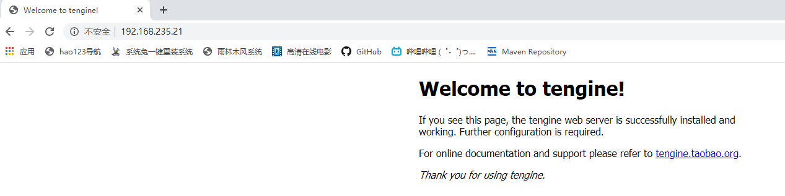

# 软件安装

## 一、编译安装

### 1、编译安装 tengine

1. 解压 tengine-2.1.0.tar.gz

   ```shell
   [root@node01 ~]# tar -xf tengine-2.1.0.tar.gz
   ```

2. 进入解压后的目录 tengine-2.1.0, 查看README，找到 Installation，查看安装说明

   ```shell
   Installation
   ------------
   Tengine can be downloaded at http://tengine.taobao.org/download/tengine.tar.gz . You can also checkout the latest source code from GitHub at https://github.com/alibaba/tengine
   
   To install Tengine, just follow these three steps:
       $ ./configure
       $ make
       # make install
   
   By default, it will be installed to /usr/local/nginx. You can use the '--prefix' option to specify the root directory.
   If you want to know all the 'configure' options, you should run './configure --help' for help.
   ```

3. 按提示，执行安装命令，默认会安装到 /usr/local/nginx， 这里安装到 /opt/nginx

   ```shell
   [root@gmall tengine-2.1.0]# ./configure --prefix=/opt/nginx
   ./configure: error: C compiler cc is not found
   ```

   报错说没有C编译器，安装gcc编译器

   ```
   [root@gmall tengine-2.1.0]# yum install gcc -y
   ```

   安装完gcc后继续执行 ./configure 命令
   报错缺少 PCRE 库

   ```
   ./configure: error: the HTTP rewrite module requires the PCRE library.
   ```

   安装PCRE库

   ```
   [root@gmall tengine-2.1.0]# yum install pcre-devel -y
   ```

   继续安装，又报错，缺少 OpenSSL 库

   ```
   ./configure: error: SSL modules require the OpenSSL library.
   ```

   安装OpenSSL库

   ```
   [root@gmall tengine-2.1.0]# yum install openssl-devel -y
   ```

   所有需要的库安装完毕后，再安装nginx，安装成功

   ```shell
   [root@gmall tengine-2.1.0]# ll
   total 656
   -rw-r--r-- 1 50469 users    889 Dec 16  2014 AUTHORS.te
   drwxr-xr-x 6 50469 users    297 Dec 16  2014 auto
   -rw-r--r-- 1 50469 users 236013 Dec 16  2014 CHANGES
   -rw-r--r-- 1 50469 users  16993 Dec 19  2014 CHANGES.cn
   -rw-r--r-- 1 50469 users 359556 Dec 16  2014 CHANGES.ru
   -rw-r--r-- 1 50469 users  22193 Dec 19  2014 CHANGES.te
   drwxr-xr-x 2 50469 users    184 Dec 16  2014 conf
   -rwxr-xr-x 1 50469 users   2435 Dec 16  2014 configure
   drwxr-xr-x 4 50469 users    109 Dec 16  2014 contrib
   drwxr-xr-x 3 50469 users     21 Dec 16  2014 docs
   drwxr-xr-x 2 50469 users     40 Dec 16  2014 html
   -rw-r--r-- 1 50469 users   1676 Dec 16  2014 LICENSE
   -rw-r--r-- 1 root  root     432 Feb  2 19:03 Makefile  # 多了一个Makefile文件
   drwxr-xr-x 2 50469 users     21 Dec 16  2014 man
   drwxr-xr-x 4 root  root     203 Feb  2 19:03 objs
   drwxr-xr-x 3 50469 users     20 Dec 16  2014 packages
   -rw-r--r-- 1 50469 users   3223 Dec 19  2014 README
   -rw-r--r-- 1 50469 users   3661 Dec 19  2014 README.markdown
   drwxr-xr-x 9 50469 users     89 Dec 16  2014 src
   drwxr-xr-x 4 50469 users     43 Dec 16  2014 tests
   -rw-r--r-- 1 50469 users     43 Dec 16  2014 THANKS.te
   ```

4. 查看Makefile ， 里面有安装说明

   ```shell
   [root@gmall tengine-2.1.0]# vi Makefile
   default:        build
   clean:
           rm -rf Makefile objs
   build:
           $(MAKE) -f objs/Makefile
           $(MAKE) -f objs/Makefile manpage
   test:
           $(MAKE) -f objs/Makefile test
   install:
           $(MAKE) -f objs/Makefile install
   dso_install:
           $(MAKE) -f objs/Makefile dso_install
   ```

   执行make命令

   ```
   [root@gmall tengine-2.1.0]# make
   [root@gmall tengine-2.1.0]# make install
   ```

   安装成功之后， 在 /opt/目录下会有一个nginx目录

5. 启动nginx

   ```shell
   [root@gmall opt]# cd nginx/
   [root@gmall nginx]# ll
   total 8
   drwxr-xr-x 2 root root 4096 Feb  2 19:18 conf
   drwxr-xr-x 2 root root   40 Feb  2 19:18 html
   drwxr-xr-x 2 root root 4096 Feb  2 19:18 include
   drwxr-xr-x 2 root root    6 Feb  2 19:18 logs
   drwxr-xr-x 2 root root    6 Feb  2 19:18 modules
   drwxr-xr-x 2 root root   35 Feb  2 19:18 sbin
   [root@gmall nginx]# cd sbin/
   [root@gmall sbin]# ll
   total 5868
   -rwxr-xr-x 1 root root   16271 Feb  2 19:18 dso_tool
   -rwxr-xr-x 1 root root 5991448 Feb  2 19:18 nginx
   [root@gmall sbin]# ./nginx  #启动nginx
   [root@gmall sbin]# ./nginx -s stop  #关闭nginx
   ```

   在浏览器中访问nginx

   

## 二、rpm 安装

### 1、安装 jdk

```shell
# 安装jdk
[root@gmall opt]# rpm -ivh jdk-8u65-linux-x64.rpm

# 查询是否安装了jdk
[root@gmall opt]# rpm -qa | grep "jdk"
jdk1.8.0_65-1.8.0_65-fcs.x86_64

# 查询已安装的软件包的安装位置
[root@gmall opt]# rpm -ql jdk1.8.0_65-1.8.0_65-fcs.x86_64 | more
可知 jdk安装到 /usr/java/jdk1.8.0_65/ 目录下

# 查询已安装的文件属于哪个软件包（需要指出文件所在绝对路径）
[root@gmall opt]# rpm -qf /usr/java/jdk1.8.0_65/bin/javac
jdk1.8.0_65-1.8.0_65-fcs.x86_64
```

**rpm 相关参数 **

```shell
-U: 升级软件，若未软件尚未安装，则安装软件；
-v：表示显示详细信息；
-h或--hash：以"#"号显示安装进度；
-a：查询所有套件；
-b<完成阶段><套件档>+或-t <完成阶段><套件档>+：设置包装套件的完成阶段，并指定套件档的文件名称；
-c：只列出组态配置文件，本参数需配合"-l"参数使用；
-d：只列出文本文件，本参数需配合"-l"参数使用；
-e<套件档>或--erase<套件档>：删除指定的套件；
-f<文件>+：查询拥有指定文件的套件；
-i：显示软件的相关信息；
-i<套件档>或--install<套件档>：安装指定的套件档；
-l：显示套件的文件列表；
-p<套件档>+：查询指定的RPM套件档；
-q：使用询问模式，当遇到任何问题时，rpm指令会先询问用户；
-R：显示套件的关联性信息；
-s：显示文件状态，本参数需配合"-l"参数使用；
-vv：详细显示指令执行过程，便于排错。
```
**rpm 查询相关命令**

```shell
rpm -q <软件名>	查询系统是否安装了指定名称的软件	rpm -q gaim
rpm -qa	查询系统中所有安装的软件	rpm -qa
rpm -qf <文件名>	查询已安装的文件属于哪个软件包（需要指出文件所在绝对路径）	rpm -qf /usr/share/pixmaps/javaws.png
rpm -ql <软件名>	查询已安装的软件包的安装位置	rpm -ql gaim
rpm -qi <软件名>	查询已安装的软件包的信息	rpm -qc gaim
rpm -qd <软件名>	查询已安装的软件包的文档的安装位置	rpm -qd gaim
rpm -qR <软件名>	查询已安装的软件包所依赖的软件和文件	rpm -qR rpm-python
```

**rpm安装java的特殊性**

```shell
# 查询jdk安装目录
[root@node01 java]# pwd
/usr/java
[root@node01 java]# ll
total 0
lrwxrwxrwx 1 root root  16 Jun 10 05:41 default -> /usr/java/latest
drwxr-xr-x 9 root root 268 Jun 10 05:41 jdk1.8.0_65
lrwxrwxrwx 1 root root  21 Jun 10 05:41 latest -> /usr/java/jdk1.8.0_65
[root@node01 alternatives]# whereis java
java: /usr/bin/java /usr/share/man/man1/java.1
[root@node01 alternatives]# ls -l /usr/bin/java
lrwxrwxrwx 1 root root 22 Jun 10 05:41 /usr/bin/java -> /etc/alternatives/java
[root@node01 alternatives]# ll /etc/alternatives/ | grep /bin/java
lrwxrwxrwx  1 root root 34 Jun 10 05:41 java -> /usr/java/jdk1.8.0_65/jre/bin/java
lrwxrwxrwx  1 root root 31 Jun 10 05:41 javac -> /usr/java/jdk1.8.0_65/bin/javac
lrwxrwxrwx  1 root root 33 Jun 10 05:41 javadoc -> /usr/java/jdk1.8.0_65/bin/javadoc
lrwxrwxrwx  1 root root 40 Jun 10 05:41 javafxpackager -> /usr/java/jdk1.8.0_65/bin/javafxpackager
lrwxrwxrwx  1 root root 31 Jun 10 05:41 javah -> /usr/java/jdk1.8.0_65/bin/javah
lrwxrwxrwx  1 root root 31 Jun 10 05:41 javap -> /usr/java/jdk1.8.0_65/bin/javap
lrwxrwxrwx  1 root root 38 Jun 10 05:41 javapackager -> /usr/java/jdk1.8.0_65/bin/javapackager
lrwxrwxrwx  1 root root 38 Jun 10 05:41 java-rmi.cgi -> /usr/java/jdk1.8.0_65/bin/java-rmi.cgi
lrwxrwxrwx  1 root root 32 Jun 10 05:41 javaws -> /usr/java/jdk1.8.0_65/bin/javaws
[root@node01 ~]# ll /etc/alternatives/ | grep jps
lrwxrwxrwx  1 root root 29 Jun 10 05:41 jps -> /usr/java/jdk1.8.0_65/bin/jps
lrwxrwxrwx  1 root root 36 Jun 10 05:41 jps.1 -> /usr/java/jdk1.8.0_65/man/man1/jps.1
```

**配置java的环境变量**

```shell
[root@node01 ~]# vi /etc/profile
在文件最后添加这两行
export JAVA_HOME=/usr/java/jdk1.8.0_65
export PATH=$PATH:$JAVA_HOME/bin
重新加载 profile 文件
[root@node01 ~]# source /etc/profile

# 环境变量配置好之后命令行窗口输入 jps 验证
```

### 2、jdk卸载重装

1. 卸载

   ```shell
   [root@node01 ~]# rpm -qa | grep jdk | xargs rpm -e --nodeps
   ```

3. 再次检查

   ```shell
   [root@node01 ~]# rpm -qa | grep jdk
   ```

4. 重新安装

## 三、yum安装

### 1、配置阿里云yum源

[官方配置yum源地址](https://developer.aliyun.com/mirror/centos?spm=a2c6h.13651102.0.0.3e221b112ElOiq)

1. 安装  wget

   ```shell
   [root@gmall yum.repos.d]# yum install wget -y
   ```

2. 备份 CentOS-Base.repo

   ```shell
   [root@gmall yum.repos.d]# mv /etc/yum.repos.d/CentOS-Base.repo /etc/yum.repos.d/CentOS-Base.repo.backup
   [root@gmall yum.repos.d]# ll
   total 28
   -rw-r--r--. 1 root root 1664 Aug 30  2017 CentOS-Base.repo.backup
   -rw-r--r--. 1 root root 1309 Aug 30  2017 CentOS-CR.repo
   -rw-r--r--. 1 root root  649 Aug 30  2017 CentOS-Debuginfo.repo
   -rw-r--r--. 1 root root  314 Aug 30  2017 CentOS-fasttrack.repo
   -rw-r--r--. 1 root root  630 Aug 30  2017 CentOS-Media.repo
   -rw-r--r--. 1 root root 1331 Aug 30  2017 CentOS-Sources.repo
   -rw-r--r--. 1 root root 3830 Aug 30  2017 CentOS-Vault.repo
   ```

3. 下载aliyun仓库

   ```shell
   # /etc/yum.repos.d/ 系统自带的yum源目录
   [root@gmall yum.repos.d]# wget -O /etc/yum.repos.d/CentOS-Base.repo http://mirrors.aliyun.com/repo/Centos-7.repo
   [root@gmall yum.repos.d]# vi CentOS-Base.repo
   baseurl=http://mirrors.aliyun.com/centos/$releasever/updates/$basearch/
           http://mirrors.aliyuncs.com/centos/$releasever/updates/$basearch/
           http://mirrors.cloud.aliyuncs.com/centos/$releasever/updates/$basearch/
   ```

4. 运行 yum makecache 生成缓存

   ```shell
   [root@gmall yum.repos.d]# yum clean all
   [root@gmall yum.repos.d]# yum makecache
   ```

**yum相关命令**

```
repolist：查看yum仓库列表
install：安装rpm软件包；
update：更新rpm软件包；
check-update：检查是否有可用的更新rpm软件包；
remove：删除指定的rpm软件包；
list：显示软件包的信息；
search：检查软件包的信息；
info：显示指定的rpm软件包的描述信息和概要信息；
clean：清理yum过期的缓存；
shell：进入yum的shell提示符；
resolvedep：显示rpm软件包的依赖关系；
localinstall：安装本地的rpm软件包；
localupdate：显示本地rpm软件包进行更新；
deplist：显示rpm软件包的所有依赖关系。
```

**yum只下载不安装**

```shell
# yum install --downloadonly --downloaddir=保存路径 软件名称
# 案例：下载samba软件及依赖软件
mkdir /soft
yum install --downloadonly --downloaddir=/soft samba
```

### 2、挂载光盘做为本地yum源


### 3、部署内网yum存储库

**服务端操作**

1. 准备工作

   ```shell
   # 关闭防火墙和 selinux
   [root@node04 ~]# systemctl disable --now firewalld
   [root@node04 ~]# setenforce 0
   setenforce: SELinux is disabled
   
   # 安装 yum-utils
   [root@node04 ~]# yum install -y yum-utils createrepo
   
   # 查看仓库并缓存仓库信息
   [root@node04 ~]# yum repolist
   repo id                              repo name                                                   status
   base/7/x86_64                        CentOS-7 - Base - mirrors.aliyun.com                        10,072
   extras/7/x86_64                      CentOS-7 - Extras - mirrors.aliyun.com                         526
   updates/7/x86_64                     CentOS-7 - Updates - mirrors.aliyun.com                      6,173
   repolist: 16,771
   [root@node04 ~]# yum makecache
   base                                                                            | 3.6 kB  00:00:00     
   extras                                                                          | 2.9 kB  00:00:00     
   updates                                                                         | 2.9 kB  00:00:00     
   (1/4): extras/7/x86_64/other_db                                                 | 154 kB  00:00:00     
   (2/4): extras/7/x86_64/filelists_db                                             | 305 kB  00:00:00     
   (3/4): updates/7/x86_64/other_db                                                | 1.6 MB  00:00:03     
   (4/4): updates/7/x86_64/filelists_db                                            |  15 MB  00:00:23     
   Metadata Cache Created
   
   # 查找包组信息
   [root@node04 ~]# find /var -name "*comps*"
   /var/cache/yum/x86_64/7/base/a4e2b46586aa556c3b6f814dad5b16db5a669984d66b68e873586cd7c7253301-c7-x86_64-comps.xml.gz
   
   # 安装nginx并创建三个工作目录
   # 默认情况Centos7中无Nginx的源rpm，需要添加Nginx的源RPM
   [root@node04 ~]# yum -y install epel-release # 添加Nginx源
   [root@node04 ~]# yum -y update               # 更新源
   [root@node04 ~]# yum -y install nginx        # 安装Nginx 
   [root@node04 ~]# mkdir -p /usr/share/nginx/html/repo/{base,updates,extras} # 软件最终存储在这三个目录里, 注意这三个目录是根据  yum repolist 命令中看到的 repo name 来确定的
   ```

2. 同步软件包

   ```shell
   # 同步软件包， 这里把同步命令封装成脚本
   #!/bin/bash
   
   # 定义需要同步的软件仓库，多个仓库已空格分隔
   repolist="base updates extras"
   for i in ${repolist}
   do
       # 从互联网仓库同步软件，并保存输出日志到 /var/log/reposync.log
       reposync -g -n -m --delete --repoid=$i --download-metadata -p /usr/share/nginx/html/repo &> /var/log/reposync.log
       # 创建仓库元数据信息
       createrepo /usr/share/nginx/html/repo/$i
   done
   # 为存在包组的存储库创建软件包组信息，不存在则不需要
   createrepo -g comps.xml /usr/share/nginx/html/repo/base
   --------------------------------------------------------------------------------------------------------------------
   # reposync 参数说明
   -g 表示删除下载后没有通过GPG检查的软件包
   -n 仅同步仓库中最新的软件
   -m 表示下载包组信息
   --delete 用于删除本地存储库中存在的但在线存储库中没有的软件包
   --repoid 指定了要同步的仓库
   --download-metadata 下载包的元数据信息
   -p 指定下载目录
   
   ```

3. 结果验证

   ```shell
   [root@node04 ~]# cd /usr/share/nginx/html/repo/
   [root@node04 repo]# ll
   total 0
   drwxr-xr-x 4 root root 150 2024-08-01 23:57:25 base
   drwxr-xr-x 4 root root  38 2024-08-01 23:55:10 extras
   drwxr-xr-x 4 root root  38 2024-08-01 23:54:42 updates
   [root@node04 repo]# du -sh *
   9.0G	base
   324M	extras
   3.4G	updates
   [root@node04 repo]# tree -d -L 2 .
   .
   ├── base
   │   ├── Packages
   │   └── repodata
   ├── extras
   │   ├── Packages
   │   └── repodata
   └── updates
       ├── Packages
       └── repodata
   
   # 表示仓库已经创建完成
   ----------------------------------------------------------------------------
   # 编辑nginx配置
   vim /etc/nginx/nginx.conf
   # 在 location块中加入这行配置
   location / {
              autoindex on;
           }
   
   # 启动nginx
   [root@node04 repo]# systemctl enable --now nginx
   
   # 在网页中访问如下地址验证
   http://node04/repo/base/
   http://node04/repo/extras/
   http://node04/repo/updates/
   ```

**客户端操作**

1. 配置yum源

   ```shell
   [root@node03 ~]# vim /etc/yum.repos.d/local.repo
   
   [BaseOS]
   baseurl=http://node04/repo/base/
   enabled=1
   gpgcheck=0
   
   [Extras]
   baseurl=http://node04/repo/extras/
   enabled=1
   gpgcheck=0
   
   [Updates]
   baseurl=http://node04/repo/updates/
   enabled=1
   gpgcheck=0
   ```

2. 结果验证

   ```shell
   [root@node03 yum.repos.d]# yum repolist -v
   Loading "fastestmirror" plugin
   Config time: 0.195
   Yum version: 3.4.3
   Repository 'BaseOS' is missing name in configuration, using id
   Repository 'Extras' is missing name in configuration, using id
   Repository 'Updates' is missing name in configuration, using id
   BaseOS                                                                          | 3.6 kB  00:00:00     
   Extras                                                                          | 2.9 kB  00:00:00     
   Updates                                                                         | 2.9 kB  00:00:00     
   (1/4): BaseOS/group_gz                                                          | 153 kB  00:00:00     
   (2/4): Extras/primary_db                                                        | 136 kB  00:00:00     
   (3/4): Updates/primary_db                                                       | 2.1 MB  00:00:00     
   (4/4): BaseOS/primary_db                                                        | 6.1 MB  00:00:00     
   Determining fastest mirrors
   Setting up Package Sacks
   pkgsack time: 0.006
   Repo-id      : BaseOS
   Repo-name    : BaseOS
   Repo-revision: 1722556511
   Repo-updated : Thu Aug  1 23:57:25 2024
   Repo-pkgs    : 10,072
   Repo-size    : 8.9 G
   Repo-baseurl : http://node04/repo/base/
   Repo-expire  : 21,600 second(s) (last: Fri Aug  2 00:19:36 2024)
     Filter     : read-only:present
   Repo-filename: /etc/yum.repos.d/local.repo
   
   Repo-id      : Extras
   Repo-name    : Extras
   Repo-revision: 1722556508
   Repo-updated : Thu Aug  1 23:55:10 2024
   Repo-pkgs    : 278
   Repo-size    : 322 M
   Repo-baseurl : http://node04/repo/extras/
   Repo-expire  : 21,600 second(s) (last: Fri Aug  2 00:19:36 2024)
     Filter     : read-only:present
   Repo-filename: /etc/yum.repos.d/local.repo
   
   Repo-id      : Updates
   Repo-name    : Updates
   Repo-revision: 1722556454
   Repo-updated : Thu Aug  1 23:54:42 2024
   Repo-pkgs    : 1,766
   Repo-size    : 3.4 G
   Repo-baseurl : http://node04/repo/updates/
   Repo-expire  : 21,600 second(s) (last: Fri Aug  2 00:19:36 2024)
     Filter     : read-only:present
   Repo-filename: /etc/yum.repos.d/local.repo
   
   repolist: 12,116
   [root@node03 yum.repos.d]# 
   ```

   


