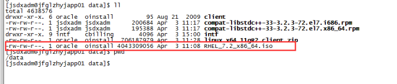

# Linux运维

# 一、配置本地yum源

 1、把linux操作系统安装包ftp到服务器某个目录



2、创建挂载目录并挂载：

```shell
mkdir -p /dvd/
mount -o loop,ro rhel-/data/RHEL_7.2_x86_64.iso /dvd/
```

3、新建yum配置文件，/etc/yum.repos.d/local.repo，必须以.repo结尾。

```shell
[rhels7.2-x86_64]
name=yum repository for /dvd
baseurl=file:///dvd
enabled=1
gpgcheck=0
 
[rhels7.2-x86_64-addons-ResilientStorage]
name=yum repository for /dvd/addons/ResilientStorage
baseurl=file:///dvd/addons/ResilientStorage
enabled=1
gpgcheck=0
 
[rhels7.2-x86_64-addons-HighAvailability]
name=yum repository for /dvd/addons/HighAvailability
baseurl=file:///dvd/addons/HighAvailability
enabled=1
```

4、清除原yum源并生成缓存

```shell
yum clean 
yum makecache
```

# 二、 管理口配置命令

1、需要先安装 ipmitool 

```shell
yum install ipmitool
```

2、管理口配置命令

```shell
ipmitool lan print 1 #打印当前ipmi 地址配置信息。
ipmitool lan set 1 ipsrc static  # 设置 id 1 为静态IP地址。
ipmitool lan set 1 ipaddr 172.168.235.11  # 设置 IPMI 地址。
ipmitool lan set 1 netmask 255.255.255.0 # 设置 IPMI 子网掩码。
ipmitool lan set 1 defgw ipaddr 172.168.235.254 # 设置 IPMI 网关。
```

3、ipmitool使用报错处理

参考处理链接： https://www.cnblogs.com/samuel610/p/10868804.html?ivk_sa=1024320u  

```shell
报错内容：
Could not open device at /dev/ipmi0 or /dev/ipmi/0 or /dev/ipmidev/0: No such file or directory

解决方法：
解决办法：需要加载相关模块
查看先关模块是否加载（可以看出模块未加载）
#lsmod |grep ^ipmi

加载以下模块
# modprobe ipmi_watchdog
# modprobe ipmi_poweroff
# modprobe ipmi_devintf
# modprobe ipmi_si  加载该模块如果没有不影响ipmi的使用（与系统版本有关）
# modprobe ipmi_msghandler  加载该模块如果没有不影响ipmi的使用
```

