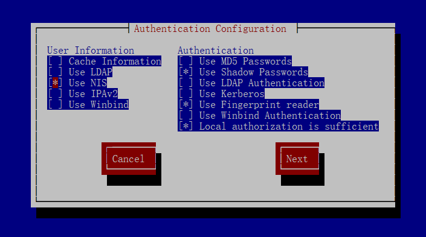
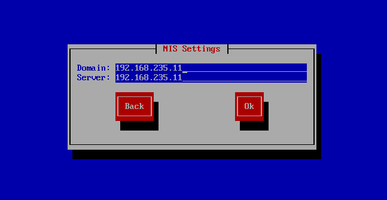

# NIS服务

# 一、NIS

**NIS: 网络信息服务（Network Information Service）**

NIS是集中控制几个系统管理数据库的网络产品。NIS简化了UNIX和LINUX桌面客户的管理工作，客户端利用它可以使用中心服务器的管理文件。桌面系统的用户无需建立他们自己的/etc/passwd，他们只简单的使用维护在NIS服务器的文件即可。管理员只需要在nis服务器上面创建，客户端加入nis域，直接可以使用Nis域上的用户来登录客户端

# 二、实验环境

服务端：node01 （192.168.235.11）

客户端：node02（192.168.235.12）

# 三、搭建NIS

## 3.1 服务器端

1. 安装ypserv服务相关的包

```shell
[root@node01 ~]# yum install -y ypserv.x86_64
```

2. ypserv相关配置文件

| 配置文件名             | 文件内容                                                     |
| ---------------------- | ------------------------------------------------------------ |
| /etc/ypserv.conf       | 这是最主要的 ypserv 软件所提供的配置文件，可以规范 NIS 客户端是否可登入的权限。 |
| /etc/hosts             | 由于 NIS server/client 会用到网络主机名与IP的对应，因此这个主机名对应档就显的相当重要！每一部主机名与 IP 都需要记录才行！ |
| /etc/netgroup          | 提供组数据及GID的对应。                                      |
| /etc/sysconfig/network | 可以在这个档案内指定 NIS 的网域 (nisdomainname)。            |
| /var/yp/Makefile       | 这就是与建立数据库有关的动作配置文件；                       |

## 3.2 客户端

1.装包，安装ypbind时，也把yp tools安装了

```shell
[root@node02 ~]# yum install -y ypbind.x86_64
[root@node02 ~]# yum install -y yp-tools.x86_64
```

2.客户端相关配置文件

| 配置文件名         | 文件内容                             |
| ------------------ | ------------------------------------ |
| /etc/hosts         | 主机名与IP地址对应关系               |
| /etc/yp.conf       | ypbind的主要配置文件，设定NIS Server |
| /etc/nsswitch.conf | 重要的配置文件，设定帐号密码等信息   |
| /var/yp/Makefile   | 与建立资料库有关的配置文件的查询顺序 |

## 3.3 部署NIS域服务器

```shell
# 创建用户
[root@node01 ~]# mkdir /home/users # 先建个目录用来管理所有的NIS账号
[root@node01 ~]# useradd -d /home/users/shenws shenws # 新建用户并指定用户目录
[root@node01 ~]# useradd -d /home/users/zhuyz -s /sbin/nologin zhuyz # 

# 指定用户密码
[root@node01 ~]# echo 'shenws123' | passwd --stdin shenws
Changing password for user shenws.
passwd: all authentication tokens updated successfully.
[root@node01 ~]# echo 'zhuyz123' | passwd --stdin zhuyz
Changing password for user zhuyz.
passwd: all authentication tokens updated successfully.

# 查看NIS域名
[root@node01 ~]# nisdomainname
nisdomainname: Local domain name not set

# 永久性修改NIS域名，需要重启后才生效
[root@node01 ~]# cat /etc/sysconfig/network
# Created by anaconda
HOSTNAME=node01
NISDOMAIN=192.168.235.11

# 临时性修改NIS域名
[root@node01 ~]# nisdomainname 192.168.235.11
[root@node01 ~]# nisdomainname
192.168.235.11

# 配置hosts文件
[root@node01 ~]# cat /etc/hosts
127.0.0.1   localhost localhost.localdomain localhost4 localhost4.localdomain4
::1         localhost localhost.localdomain localhost6 localhost6.localdomain6
192.168.235.11 node01
192.168.235.12 node02

# 配置 /etc/ypserv.conf 主配置文件，让所有内网客户端可以连接NIS服务器，除此之外的客户端都拒绝连接

# The following, when uncommented,  will give you shadow like passwords.
# Note that it will not work if you have slave NIS servers in your
# network that do not run the same server as you.

# Host                     : Domain  : Map              : Security 
#
# *                        : *       : passwd.byname    : port 
# *                        : *       : passwd.byuid     : port

# Not everybody should see the shadow passwords, not secure, since
# under MSDOG everbody is root and can access ports < 1024 !!!
*			   : *       : shadow.byname    : port
*			   : *       : passwd.adjunct.byname : port
127.0.0.1/255.0.0.0        : *       : *                     : none # 允许本机访问所有域所有数据库，不限制端口
192.168.0.0/255.255.255.0  : *       : *                     : none # 允许 192.168 网段地址 访问所有域所有数据库，不限制端口
*                          : *       : *                     : deny # 不允许其他机器访问端口
---------------------------------------------------------------------------------------------------------------------------------
/etc/ypserv.conf 配置格式为

Host : Domain : Map : Security

- **Host ：为Client的ip或者网段，用来划分服务对象的**

  - 127.0.0.0/255.255.255.0

- **Domain：为 NIS域名，这里的域名和DNS中的域名并没有关系**

- - 一般情况都直接写*****号以用来代表全部

- **Map：为可用数据库**

  - 就是由NIS制作出来的数据库名称，可以用*代替所有数据库

- **Security ：为权限限制，主要有nod、port和deny三种参数设置**

  - none：没有限制，都可以连接NIS服务器
  - port：只允许小于1024以下的商品连接NIS服务器
  - deny：拒绝连接NIS服务器
---------------------------------------------------------------------------------------------------------------------------------

# 建立NIS数据库
[root@node01 ~]# service ypserv start # 先把服务启起来，否则建立NIS数据库会报错
[root@node01 ~]# /usr/lib64/yp/ypinit -m # 每次手动更改数据库内容后，都需要执行这个命令

At this point, we have to construct a list of the hosts which will run NIS
servers.  node01 is in the list of NIS server hosts.  Please continue to add
the names for the other hosts, one per line.  When you are done with the
list, type a <control D>.
	next host to add:  node01
	next host to add:  # 按 ctrl + d 结束
The current list of NIS servers looks like this:

node01

Is this correct?  [y/n: y]  y
We need a few minutes to build the databases...
Building /var/yp/192.168.235.11/ypservers...
Running /var/yp/Makefile...
gmake[1]: Entering directory `/var/yp/192.168.235.11'
Updating passwd.byname...
Updating passwd.byuid...
Updating group.byname...
Updating group.bygid...
Updating hosts.byname...
Updating hosts.byaddr...
Updating rpc.byname...
Updating rpc.bynumber...
Updating services.byname...
Updating services.byservicename...
Updating netid.byname...
Updating protocols.bynumber...
Updating protocols.byname...
Updating mail.aliases...
gmake[1]: Leaving directory `/var/yp/192.168.235.11'

node01 has been set up as a NIS master server.

Now you can run ypinit -s node01 on all slave server.
[root@node01 ~]# cd /var/yp/
[root@node01 yp]# ll
total 24
drwxr-xr-x 2 root root   324 2023-10-06 21:42:29 192.168.235.11
-rw-r--r-- 1 root root 17410 2019-08-09 03:26:57 Makefile
-rw-r--r-- 1 root root     7 2023-10-06 21:40:44 ypservers

# 重启服务并设置开机启动
[root@node01 ~]# service ypserv restart
[root@node01 ~]# service yppasswdd restart
[root@node01 ~]# chkconfig ypserv on
[root@node01 ~]# chkconfig yppasswdd on
```

## 3.4 将客户端加入域

```shell
# 这里和Server配置一样，domain要一致，否则无法使用。直接用nisdomainname命令来设置
[root@node02 ~]# nisdomainname 192.168.235.11
[root@node02 ~]# nisdomainname
192.168.235.11
```

**设置连接**

在目录含中输入，可以进入半图形化的设置界面。

```shell
authconfig-tui # 也可以使用setup命令调用半图形化界面，需要先安装yum -y install setuptool
```







