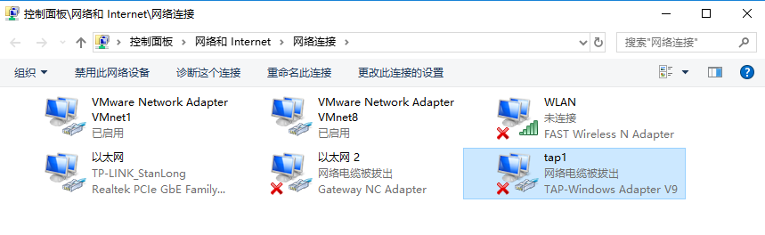
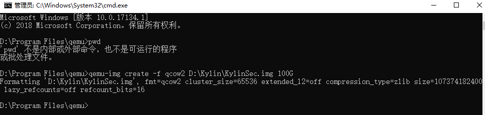
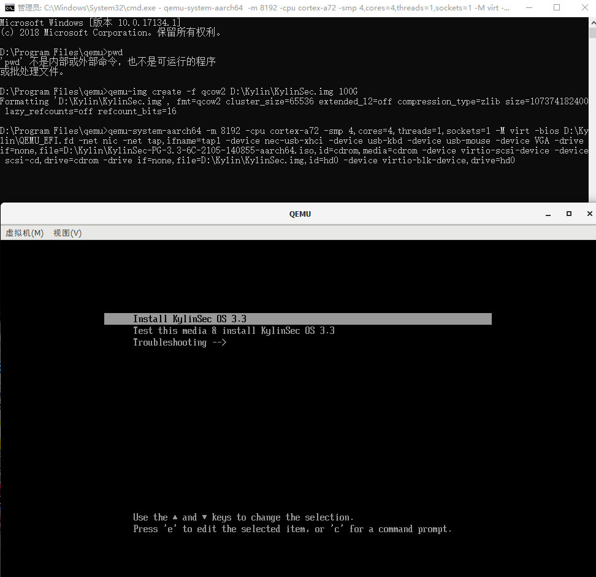
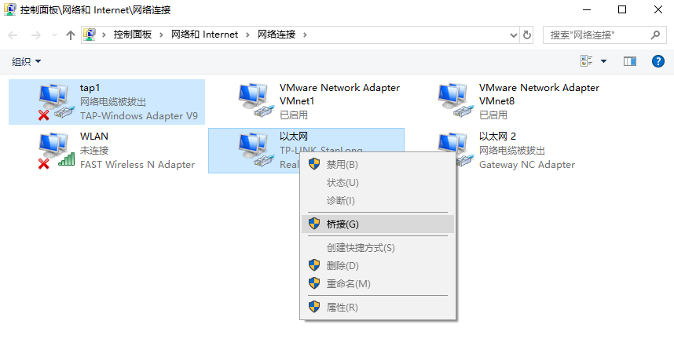
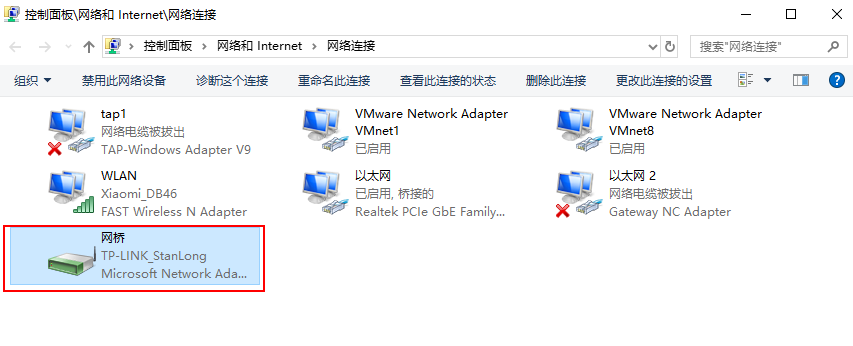
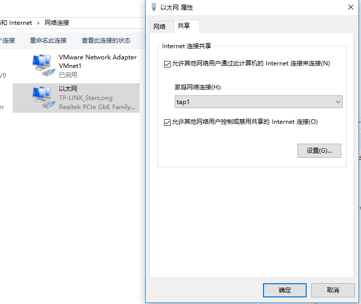
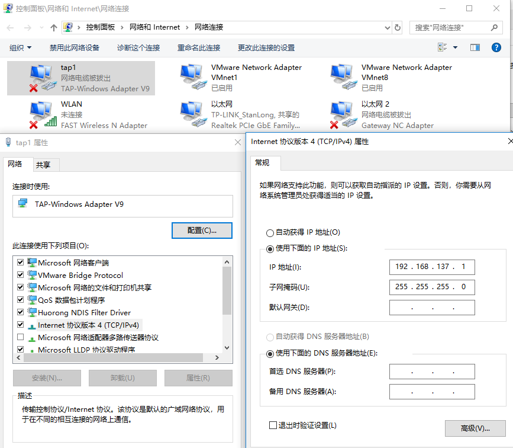

# QEMU虚拟机

## 一、背景介绍

要安装一个 KylinSec-PG-3.3-6C-2105-140855-aarch64.iso ， 这个是麒麟信安的操作系统，基于aarch64架构，这个架构在VMware上模拟不起来，因此需要用 qemu 来模拟。

## 二、软件说明

安装过程中需要用到的组件如下

- KylinSec-PG-3.3-6C-2105-140855-aarch64.iso 需要安装的镜像文件
  - 下载地址：  https://mirrors.kylinsec.com.cn/V3.3-6/.isos-pg/aarch64/
- qemu-w64-setup-20210505.exe  虚拟机
  - 下载地址： https://qemu.weilnetz.de/w64/
- tap-windows-9.9.2_3.exe  虚拟网卡
  - 下载地址： 
- QEMU_EFI.fd  图形界面
  - 下载地址：[QEMU_EFI.fd](http://releases.linaro.org/components/kernel/uefi-linaro/16.02/release/qemu64/QEMU_EFI.fd)

## 三、安装步骤

### 1、目录准备

准备一个空目录如 D:\Kylin，将 KylinSec-PG-3.3-6C-2105-140855-aarch64.iso 和 QEMU_EFI.fd都放到这个目录里

### 2、安装 qemu-w64-setup-20210505.exe

记住安装目录， 我这里安装在了  D:\Program Files\qemu

### 3、安装 tap-windows-9.9.2_3.exe

这个是tap虚拟网卡，安装完成后会在网络连接里看到一张TAP网卡， 这里给网卡重命名成 tap1，方便在后续命令里使用这张网卡。



## 四、执行相关命令

- 创建一个 qcow2 格式的镜像文件，文件名任意

  ```
  qemu-img create -f qcow2 D:\Kylin\KylinSec.img 100G
  ```

  

- 执行启动命令

  启动命令会进入系统的安装界面，安装过程略

  ```
  qemu-system-aarch64 -m 8192 -cpu cortex-a72 -smp 4,cores=4,threads=1,sockets=1 -M virt -bios D:\Kylin\QEMU_EFI.fd -net nic -net tap,ifname=tap1 -device nec-usb-xhci -device usb-kbd -device usb-mouse -device VGA -drive if=none,file=D:\Kylin\KylinSec-PG-3.3-6C-2105-140855-aarch64.iso,id=cdrom,media=cdrom -device virtio-scsi-device -device scsi-cd,drive=cdrom -drive if=none,file=D:\Kylin\KylinSec.img,id=hd0 -device virtio-blk-device,drive=hd0
  ```

  

- 重启系统

  重启系统的命令不需要指定iso文件了

  ```
  qemu-system-aarch64 -m 8192 -cpu cortex-a72 -smp 4,cores=4,threads=1,sockets=1 -M virt -bios D:\Kylin\QEMU_EFI.fd -net nic -net tap,ifname=tap1 -device nec-usb-xhci -device usb-kbd -device usb-mouse -device VGA -drive if=none,file=,id=cdrom,media=cdrom -device virtio-scsi-device -device scsi-cd,drive=cdrom -drive if=none,file=D:\Kylin\KylinSec.img,id=hd0 -device virtio-blk-device,drive=hd0
  ```

  

## 五、网络配置

### 1、网桥模式

- 配置桥接网络

  将tap虚拟网卡和实际使用的物理网卡桥接起来

  

  配置好之后会出现一个网桥

  

- 网络配置

  在宿主机上执行 ipconfig，记录下ip地址、子网掩码、网关。 虚拟机上配置同样网段的IP即可。

### 2、共享模式

将本地网络共享给 tap1



共享成功后，tap1网卡会分配一个固定的地址



192.168.137.1 在虚拟机上要配置成路由的地址

## 六、快照命令

创建快照： qemu-img snapshot -c 快照名称 镜像名称(D:/Kylin/KylinSec.img) 

查看快照： qemu-img snapshot -l 快照名称 镜像名称(D:/Kylin/KylinSec.img) 

删除快照： qemu-img snapshot -d 快照名称 镜像名称(D:/Kylin/KylinSec.img) 

恢复快照： qemu-img snapshot -a 快照名称 镜像名称(D:/Kylin/KylinSec.img) 

-- 快照名称和镜像名称最好都用绝对路径

## 七、命令参数说明

```
说明：
#####################################################################################################################
-m 4000 表示分配给虚拟机的内存最大4000MB，可以直接使用 -m 4G

-cpu cortex-a72 指定CPU类型，还可以选择cortex-a53、cortex-a57等

-smp 4,cores=4,threads=1,sockets=1 指定虚拟机最大使用的CPU核心数等

-M virt 指定虚拟机类型为virt，具体支持的类型可以使用 qemu-system-aarch64 -M help 查看

-bios D:\Kylin\QEMU_EFI.fd 指定UEFI固件文件

-net tap,ifname=tap1 启用网络功能（ifname=tap1212中的tap1212请修改为前面步骤中自己修改后的网卡名称）

-device nec-usb-xhci -device usb-kbd -device usb-mouse 启用USB鼠标等设备

-device VGA 启用VGA视图，对于图形化的Linux这条很重要！

-drive if=none,file=D:\Kylin\Kylin-Server-10-SP2-aarch64-Release-Build09-20210524.iso,id=cdrom,media=cdrom 指定光驱使用镜像文件

-device virtio-scsi-device -device scsi-cd,drive=cdrom 指定光驱硬件类型

-drive if=none,file=D:\Kylin\Kylin.img 指定硬盘镜像文件
```


